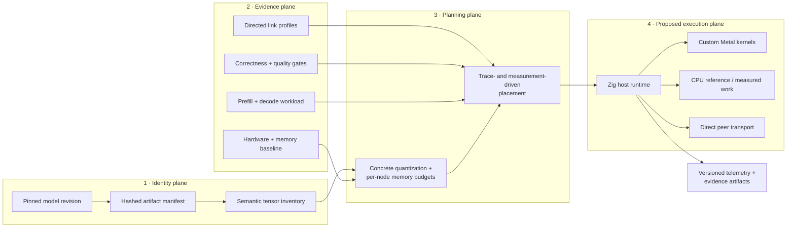

<div align="center">

# QW5

### Evidence-first architecture for local LLM inference on Apple silicon

**A systems-design case study for model identity, unified-memory planning, sparse
inference, Metal execution, peer transport, and reproducible deployment decisions.**

[](https://github.com/anonymuse/QW5/actions/workflows/ci.yml)
[](docs/architecture/README.md)
[](docs/hardware/topology.md)
[](.zig-version)
[](LICENSE)

[Architecture](docs/architecture/README.md) ·
[Outcomes](#what-qw5-produced) ·
[Cluster blueprint](#using-the-design) ·
[Completion plan](docs/portfolio/completion-plan.md) ·
[Contributing](CONTRIBUTING.md)

</div>

> [!IMPORTANT]
> QW5 is an architecture and validation case study—not a working inference engine.
> The original three-Mac home-cluster program ended before hardware measurements,
> model acquisition, Metal kernels, distributed execution, or token generation. The
> decision to preserve the engineering work as a portfolio reference is recorded in
> [ADR-0008](docs/architecture/adr/0008-portfolio-transition.md).

## The short version

QW5 explored a hard question: **what would it take to run a frontier-class,
mixture-of-experts model across a heterogeneous Apple-silicon cluster without hiding
the core inference path behind another complete engine?**

The answer began with architecture, not code volume. Before spending on model
downloads or cluster execution, QW5 specified immutable artifact identity, tensor-
aware quantization, per-node memory budgets, prefill/decode separation, peer message
classes, application-path measurement, fail-closed placement gates, benchmark
provenance, and AI-authored development controls.

The physical deployment strategy later changed: the home cluster was abandoned in
favor of a likely future single high-memory Mac. QW5 therefore closes as a design case
study and offline validation kit. That outcome is useful in its own right—it shows how
to de-risk a local-LLM platform, identify what must be measured, and stop before an
obsolete assumption turns into expensive implementation.

## At a glance

| | |
| --- | --- |
| **Original target** | A Qwen-specific Zig + Metal runtime across three directly connected, heterogeneous Macs |
| **Current product** | An Apple-silicon inference architecture case study and reproducible validation design |
| **Merged implementation** | Zig 0.16.0 foundation utility, deterministic tests, limited compiler-target inventory, and Apple-silicon CI |
| **Advanced design work** | Contract/schema/fixture/validator package preserved in draft PR [#3](https://github.com/anonymuse/QW5/pull/3) pending portfolio curation |
| **Measured cluster results** | None |
| **Inference capability** | None—QW5 does not load a model or generate tokens |
| **Future direction** | A separate model-specific, single-machine program first; orchestration only if a measured requirement justifies it |

## Why this problem matters

Running an open-weight model locally is not just a “does the weight file fit in RAM?”
question. A defensible deployment has to reconcile:

- exact model revision, license, file set, tokenizer, template, and tensor identities;
- quantized weight bytes **plus** scales, metadata, padding, exceptions, state,
  scratch, transport buffers, fragmentation, and operating-system headroom;
- model architecture—dense or MoE, attention type, recurrent state, expert routing,
  context behavior, and multimodality;
- CPU, GPU, unified-memory, storage, and interconnect behavior under the real workload;
- correctness and quality before optimization;
- prefill, time to first token, and autoregressive decode as separate regimes; and
- reproducible evidence that distinguishes a measurement from an estimate, simulation,
  or target.

Those concerns survive a topology change. A single 128 GB Mac removes network
placement but not artifact integrity, memory headroom, tensor-specific quantization,
kernel correctness, long-context state, thermals, or observability. A future cluster
adds topology and scheduling back only when one machine cannot meet the workload.

## Reference architecture



The original design separated four planes so that model churn or a topology change
would not invalidate the whole system:

1. **Identity:** pin and hash every upstream and derived artifact; classify tensors by
   execution role.
2. **Evidence:** inventory hardware, establish memory baselines, measure kernels and
   every directed peer path, and preserve missing/error states.
3. **Planning:** choose concrete layouts and place weights, experts, state, scratch,
   and traffic against per-node budgets—not aggregate marketing specifications.
4. **Execution:** let Zig own loading, memory, scheduling, transport, and telemetry;
   use custom Metal for critical GPU work and CPU references for correctness.

See the full [architecture guide](docs/architecture/README.md), the historical
[topology](docs/hardware/topology.md), and the
[benchmark methodology](docs/benchmarks/methodology.md).

## Design principles

- **Correctness before speed.** A plausible completion is not a logit test, and a smoke
  test is not inference correctness.
- **Measurement before placement.** Chip names and link standards do not establish
  kernel throughput, usable memory, concurrency, copy count, or thermal behavior.
- **Memory fit before deployment claims.** Even a legal allocation does not prove
  quality, required kernels, stability, or useful performance.
- **Prefill is not decode.** Report their different compute, memory, state, and traffic
  profiles separately.
- **Coordinator is not relay.** A logical control plane should not force every data
  packet through one node.
- **Missing evidence fails closed.** `UNDETERMINED` is a legitimate result; invented
  defaults are not.
- **Negative results belong in the product.** Rejected layouts, transports, or
  feasibility gates improve the next decision.
- **Oracles are not the production runtime.** MLX, llama.cpp, Transformers, PyTorch,
  and vendor systems can validate behavior without being passed off as original QW5
  execution.

## What QW5 produced

### Merged foundation

- Project charter, Apache-2.0 license, contribution policy, and durable agent workflow.
- Public AI-development provenance and Codex co-authorship policy.
- Evidence vocabulary and a benchmark method designed to prevent headline-driven
  reporting.
- ADRs for model strategy, runtime ownership, and measurement-before-placement.
- Historical three-node topology and a public-safe inventory design.
- Zig 0.16.0 build, executable, unit tests, deterministic smoke test, and pinned
  Apple-silicon CI.

### Preserved advanced design package

Draft PR [#3](https://github.com/anonymuse/QW5/pull/3) contains the project's deepest
systems-design work:

- **16** JSON Schemas and **16** positive fixtures;
- **87** committed hostile cases plus bundle-level adversarial checks;
- canonical JSON and content-addressed evidence graphs;
- hardware inventory and repeated clean-memory-baseline contracts;
- a **246-cell** application-path Thunderbolt 5 measurement design with route-proof
  requirements;
- exact wire, canonicalization, evidence-linkage, and SafeTensors vectors;
- model acquisition, tensor inventory, quantization, placement, and fail-closed
  feasibility contracts;
- a versioned semantic validator with pinned validation dependencies; and
- four proposed ADRs plus the now-historical 16-task M1 execution decomposition.

This package was synthetically validated as documented in the PR. It was not merged,
run on the target Macs, or used to prove inference feasibility. The
[completion plan](docs/portfolio/completion-plan.md) defines a provenance-preserving
curation path.

### The outcome

QW5 did not answer whether the proposed 397B deployment would work. It produced the
architecture and evidence gates required to answer that question honestly, then
stopped when the deployment premise changed. For a consulting portfolio, that is the
point: good systems work includes feasibility boundaries, decision quality, and an
orderly exit—not only a demo at any cost.

## Try the merged foundation

Install the pinned [Zig 0.16.0](https://ziglang.org/download/) toolchain, then:

```console
zig version
zig fmt --check build.zig src
zig build
zig build test
zig build smoke
zig build run -- inventory
```

`zig build smoke` checks the fixed output `QW5 bootstrap smoke: ok`. The `inventory`
command reports only compiler-target metadata under `bootstrap-target-v1`; it does not
probe a Mac cluster. The portfolio plan adds an offline synthetic walkthrough rather
than pretending unavailable hardware exists.

## Using the design

### For an Apple-silicon cluster

Use QW5 as a sequence of engineering gates:

1. define the workload, privacy boundary, success criteria, and budget;
2. inventory each node and establish repeatable available-memory baselines;
3. prove and characterize every directed peer route alone and under concurrency;
4. pin the exact model revision, files, license, tokenizer, template, and tensor map;
5. define quantization by tensor class and validate quality independently of size;
6. model prefill and decode separately, including state and message traffic;
7. solve legal per-node placements from measured profiles and explicit reserves;
8. implement the smallest correct execution path, then optimize measured bottlenecks;
9. expose a stable local API, telemetry, failure behavior, and operational runbook; and
10. publish raw evidence, limitations, and negative results with the recommendation.

### For one high-memory Mac

Keep identity, quantization, correctness, observability, and evidence; collapse network
placement. Select one exact model and one workload, prove memory headroom, establish
oracle-backed logits and generation, move the hot path to Metal, then measure prefill,
decode, long-context state, thermals, power, and stability. Add orchestration later
only if a real requirement—not enthusiasm for clustering—demands it.

The owner's future direction is closer to the deliberately model-specific approach
shown by [antirez/ds4](https://github.com/antirez/ds4): narrow architecture, readable
runtime, correctness gates, and hardware-specific optimization. QW5 treats DS4 as an
inspiration and reference, not a source donor or result.

## Why this remains timely

The open-weight ecosystem changes faster than a long custom-runtime project. Current
examples include [Moonshot AI's Kimi family](https://huggingface.co/moonshotai/models),
[Thinking Machines' Inkling](https://huggingface.co/thinkingmachines/Inkling), and
[Qwen 3.5](https://huggingface.co/Qwen/Qwen3.5-397B-A17B). Apple's
[MLX](https://github.com/ml-explore/mlx) continues to expose Apple silicon's unified-
memory model, while focused runtimes explore architecture-specific tradeoffs.

QW5 deliberately avoids a “best model” leaderboard. It offers a durable selection and
deployment method: verify the exact license and revision, classify the architecture,
inventory the artifacts, model the complete working set, validate quantization quality,
and measure the target workload. QW5 does **not** claim compatibility with any model
named above.

“Open-weight” is also intentional wording. Available weights, open source, training-
data disclosure, redistribution, commercial rights, and practical local support are
different properties and must be checked independently.

## Consulting capabilities represented

| Capability | Repository evidence |
| --- | --- |
| Local-LLM feasibility and hardware sizing | Per-node budget model, headroom policy, evidence labels, and go/no-go gates |
| Apple-silicon systems architecture | Unified-memory boundary, Zig/Metal split, CPU participation rules, and historical TB5 topology |
| Distributed inference design | Message classes, direct-peer principle, trace-driven placement, and prefill/decode separation |
| Model and quantization planning | Immutable artifact identity, tensor classification, concrete layout requirements, and quality boundary |
| Benchmark and observability design | Reproducibility manifests, workload identity, raw-evidence retention, and negative-result policy |
| AI-led engineering governance | Agent routing, path ownership, ADRs, provenance, adversarial fixtures, and review gates |
| Technical program judgment | Explicit unknowns, cost gates, scope control, and the documented decision to stop obsolete execution |

The repository demonstrates these methods and artifacts. It does not claim client
outcomes, production operations, or performance results that were never produced.

## Evidence labels

QW5 uses four labels at the point of every quantitative claim:

- **MEASURED** — observed by a documented procedure on identified hardware and
  software, with raw artifacts retained;
- **SIMULATED** — produced by a named simulation and declared assumptions;
- **ESTIMATED** — calculated or inferred from stated inputs;
- **TARGET** — desired but not demonstrated.

Fixtures remain `SIMULATED`. Upstream specifications remain attributed upstream
facts. Third-party measurements remain third-party results.

## Project map

- [`PROJECT_HANDOFF.md`](PROJECT_HANDOFF.md) — current mandate, truth baseline, reuse
  paths, and non-negotiable boundaries.
- [`docs/architecture`](docs/architecture/README.md) — reference architecture and ADRs.
- [`docs/benchmarks/methodology.md`](docs/benchmarks/methodology.md) — correctness and
  reproducibility requirements.
- [`docs/hardware/topology.md`](docs/hardware/topology.md) — historical target topology
  and unmeasured facts.
- [`docs/portfolio/completion-plan.md`](docs/portfolio/completion-plan.md) — complete
  P00–P10 task contracts for lower-cost agents.
- [`docs/coordination`](docs/coordination/README.md) — durable task state and workflow.
- [`AI_PROVENANCE.md`](AI_PROVENANCE.md) — public AI-authorship disclosure.
- [`AGENTS.md`](AGENTS.md) — repository-wide execution guardrails.

## Road to the portfolio release

The old M1–M5 inference roadmap is closed. The replacement plan is deliberately finite:

1. publish this pivot from a clean, branch-aware checkout;
2. preserve and curate PR #3 without rewriting its draft history;
3. harden the schema/fixture/validator package for offline use;
4. add the full case study, cluster blueprint, and single-node future roadmap;
5. build a deterministic `SIMULATED` walkthrough and honest status CLI;
6. automate documentation, privacy, claim, and generated-output checks; and
7. perform an adversarial clean-clone review and publish `v1.0.0` with owner approval.

Every remaining task, path, dependency, agent tier, acceptance test, and release gate
is frozen in the [portfolio completion plan](docs/portfolio/completion-plan.md).

## Contributing

Corrections, design review, fixture improvements, reproducibility work, and bounded
portfolio tasks are welcome. Inference implementation and physical cluster work are
out of scope unless the owner starts a new program. Read
[`CONTRIBUTING.md`](CONTRIBUTING.md) and [`AGENTS.md`](AGENTS.md) before proposing a
change.

## License and authorship

QW5 is licensed under the [Apache License 2.0](LICENSE).

Original QW5 code and documentation are intended to be AI-authored, human-directed,
publicly reviewed, and evidence-verified. Dependencies, model weights, frameworks,
research, standards, and adapted third-party material are attributed separately. See
[`AI_PROVENANCE.md`](AI_PROVENANCE.md) for the disclosure policy.
