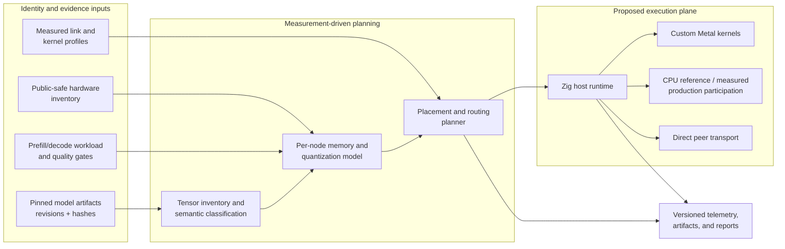

# Architecture

QW5 is a reference architecture and engineering case study for model-specific local
LLM inference on Apple silicon. The original design targeted a heterogeneous
three-node Thunderbolt 5 mesh. The owner concluded that implementation program before
hardware measurement or inference and retained the architecture as reusable consulting
IP. See [ADR-0008](adr/0008-portfolio-transition.md).

This directory describes a design, not a working runtime. Terms such as “planner,”
“transport,” and “Metal kernels” name proposed system components unless a document
explicitly identifies an implementation artifact.

## System question

The original thesis asked whether a model-aware runtime could make a frontier-class
sparse model practical across memory-constrained Macs by combining:

- immutable model and tensor identity;
- mixed quantization by tensor role;
- unified-memory budgets with explicit operating-system and scratch headroom;
- trace-driven expert and state placement;
- custom Metal kernels plus correctness-first CPU references;
- direct peer communication rather than mandatory coordinator relay; and
- evidence that keeps prefill, decode, transport, quality, and feasibility separate.

The project stopped before answering that empirical question. Its durable outcome is
the method for answering it without turning assumptions into product claims.

## Reference architecture

The four planes are deliberately separable:

1. **Identity plane:** exact model revisions, content hashes, tensor roles, layouts,
   quantization metadata, and derived-artifact lineage.
2. **Evidence plane:** hardware facts, memory baselines, link profiles, kernel results,
   quality checks, workload definitions, and explicit unavailable/error states.
3. **Planning plane:** per-node budgets, expert/state placement, message routes, and
   gates that fail closed when evidence is missing.
4. **Execution plane:** model loading, prefill/decode, state management, Metal/CPU
   work, peer transport, telemetry, and the local API.

The same separation applies to a single large Mac: the placement problem collapses,
but artifact identity, memory headroom, tensor-specific quantization, correctness, and
telemetry remain essential.

## Design invariants

- Correctness precedes optimization.
- Each model input is pinned by repository, immutable revision, and verified hashes.
- Physical measurements precede hardware placement decisions.
- Aggregate RAM is not proof of a legal per-node allocation.
- Prefill and autoregressive decode have separate performance models.
- SSD is a cold artifact and promotion tier until evidence supports another role.
- CPU participation needs a correctness, overlap, or measured-performance reason.
- Direct peer traffic is preferred only when observed application-path behavior
  supports it.
- Simulations, estimates, targets, and measurements never silently change class.
- Negative and undetermined results are valid outcomes.

## Runtime boundary in the original design

Zig was selected for host control, model loading, validation, memory management,
orchestration, transport, telemetry, and execution planning. Custom Metal kernels were
intended for performance-critical GPU operations. CPU kernels were intended first as
correctness references and only later as measured production participants. Python was
limited to offline inspection, conversion, calibration, oracle generation, analysis,
and reproducibility tooling.

QW5 was designed to own the production inference path. MLX, llama.cpp, PyTorch,
Transformers, and vendor runtimes were allowed as oracles, conversion references, and
baselines—not as an undisclosed QW5 executor. No production path was implemented.

## Decision records

Merged decisions:

- [`ADR-0001: Model strategy`](adr/0001-model-strategy.md) — historical target
  sequence and memory-floor reasoning.
- [`ADR-0002: Runtime ownership and dependency boundaries`](adr/0002-runtime-ownership-and-dependency-boundaries.md)
  — clean production/runtime boundary.
- [`ADR-0003: Measurement before placement`](adr/0003-measurement-before-placement.md) — evidence-first topology and placement policy.
- [`ADR-0008: Portfolio transition`](adr/0008-portfolio-transition.md) — concludes the
  physical program and defines the finished case-study boundary.

Draft PR [#3](https://github.com/anonymuse/QW5/pull/3) also contains proposed ADRs
0004–0007 covering canonical artifact identity, application-path TB5 measurement,
the distinction between memory fit and deployment feasibility, and empirical
simultaneous-attempt inclusion. Their draft status is part of the public record; the
portfolio completion plan defines how to curate them without rewriting history.

## What is reusable

- The evidence labels and benchmark methodology apply to any local-model feasibility
  study.
- The artifact graph and tensor-inventory design apply to single-node and distributed
  runtimes.
- The per-node budget and fail-closed placement rules apply to heterogeneous clusters.
- The direct-path measurement design applies when evaluating Thunderbolt or another
  peer fabric.
- The clean separation among oracle, converter, baseline, and production runtime
  keeps consulting recommendations and authorship claims defensible.

For the exact closeout queue, runnable-demo boundary, and publication gates, see the
[`portfolio completion plan`](../portfolio/completion-plan.md).
