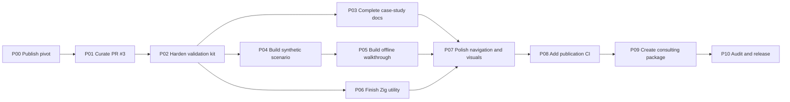

# QW5 Portfolio Completion Plan

- **Status:** execution-ready after publication of P00
- **Owner decision date:** 2026-07-19
- **Program outcome:** portfolio architecture case study and offline reference kit

## 1. Mission

Finish QW5 as a flagship public case study in local-LLM systems architecture. Preserve
the original Apple-silicon cluster design, the contracts and adversarial validation
work produced for it, and the lessons that transfer to client deployments. Add a
deterministic synthetic walkthrough so the repository is useful without the abandoned
home cluster.

Completion does **not** require an inference engine, model weights, a physical cluster,
or a performance result. It requires a coherent product boundary, runnable design
artifacts, honest evidence, polished technical communication, and a reproducible
release.

This plan is written as the source contract for lower-cost coding agents. An agent must
execute only one dependency-ready task at a time. If a task needs a decision outside
its frozen contract, it stops and records the exact question instead of inventing a
new project direction.

## 2. Truth baseline

Agents must preserve this status until repository evidence changes it:

- Merged PRs #1 and #2 establish the foundation on `main` at
  `c8e71bda5246c1e39b4d82ab416934b93280ff25`.
- Draft PR #3 head `ad45675088a27c2e05ad7cd89e683bfb169fd4e7` contains a validated
  design package: 16 schemas, 16 positive fixtures, 87 hostile cases, a semantic
  validator, four proposed ADRs, and a 16-task historical M1 plan.
- PR #3 is not merged and none of its physical tasks ran.
- QW5 collected no cluster inventory or TB5 measurement.
- QW5 downloaded no target model and created no tensor inventory or quantization.
- QW5 implemented no tokenizer, model loader, inference operator, Metal kernel,
  distributed transport, scheduler, API, or token generation.
- The merged Zig program is a small foundation utility with deterministic smoke and
  compiler-target inventory output.
- The owner has ended the home-cluster implementation. Future single-node or
  distributed inference is a separate program requiring new authorization.

## 3. Product definition

The release name is **QW5 Architecture Case Study & Validation Kit**.

The product has five surfaces:

1. **Narrative:** a flagship README and consulting case study that explain the problem,
   architecture, outcomes, limits, and reuse paths.
2. **Design records:** ADRs, topology, benchmark method, contracts, and model/runtime
   boundaries with historical status intact.
3. **Validation kit:** versioned schemas, positive and hostile fixtures, canonical
   identity rules, and a deterministic semantic validator.
4. **Offline walkthrough:** fictional, explicitly `SIMULATED` inputs that demonstrate
   artifact lineage and fail-closed feasibility reasoning without suggesting a real
   deployment.
5. **Future blueprints:** one guide for Apple-silicon cluster engagements and a
   separate, non-binding roadmap for a model-specific single high-memory Mac engine.

### Target repository shape

```text
README.md
PROJECT_HANDOFF.md
docs/
  architecture/
  benchmarks/
  case-study/
    README.md
    outcomes-and-lessons.md
    apple-silicon-cluster-blueprint.md
    single-node-future-roadmap.md
    model-selection-method.md
  contracts/
  generated/
    simulated-walkthrough.md
  portfolio/
    completion-plan.md
    consulting-brief.md
    release-checklist.md
  provenance/
fixtures/
  contracts/v1/
  portfolio/v1/
schemas/v1/
src/
tools/
  validate_contracts.py
  portfolio_demo.py
  check_docs.py
```

Names may change only through the owning task's reviewed PR. Do not create duplicate
guides with slightly different titles.

## 4. Cost-aware execution rules

### Agent routing

| Route | Use | Tasks in this plan |
| --- | --- | --- |
| Sol / Medium–High | Source/provenance decisions, architecture integration, final adversarial review | P00, P01, P10 |
| Terra / Medium–High | Bounded code, CI, documentation, and report-generation work | P02, P03, P05, P06, P08 |
| Luna / Low–Medium | Exact fixture, navigation, inventory, and release-material work | P04, P07, P09 |

Do not route a task upward merely because a first attempt failed. First narrow the
failure to the frozen acceptance check. Escalate to Sol only for a genuine contract,
claim, provenance, or cross-cutting decision.

### One-task protocol

Every task must:

1. start from fetched, current `main` after all dependencies are merged;
2. use one `codex/<task-id>-<short-name>` branch, one worktree, and one draft PR;
3. record objective, owner, paths, inputs, dependencies, and checks on the active board
   before writing;
4. edit only its owned paths;
5. add or update its PR-owned provenance record;
6. run the task checks plus global checks that are available at that point;
7. review the complete diff for claim, privacy, license, and source-boundary defects;
8. leave the next task unclaimed until the current PR is merged and the board is
   reconciled; and
9. avoid model downloads, remote-node access, paid inference, or physical benchmarks.

No parallel writers are authorized by this plan. If the owner later authorizes
parallel work, only P03 and P04 have naturally disjoint paths after P02, and the board
must assign those paths explicitly.

### Standard kickoff prompt

Use this prompt with the task-specific contract below:

```text
Execute only QW5 portfolio task <TASK_ID> from
docs/portfolio/completion-plan.md. Read README.md, PROJECT_HANDOFF.md, AGENTS.md,
the active board, ADR-0008, and every input named by the task. Start from current
main, claim only the listed paths, and preserve unrelated work. Do not resume the
cluster implementation, download models, access hardware, or create performance
claims. Implement the deliverables, run every acceptance check, update the task-owned
provenance record, and open one draft PR. Stop with a concise blocker if a frozen
input is absent or contradictory; do not widen scope.
```

## 5. Dependency map



## 6. Task index

| ID | Task | Route | Depends on | Primary result |
| --- | --- | --- | --- | --- |
| P00 | Publish the owner pivot and master plan | Sol / Medium | None | Current source of truth on a real branch |
| P01 | Preserve and curate draft PR #3 | Sol / High | P00 | Contract suite retained without obsolete execution state |
| P02 | Harden the offline validation kit | Terra / High | P01 | Reproducible schemas, fixtures, validator, and CI |
| P03 | Complete the technical case study and blueprints | Terra / Medium | P02 | Full consulting-quality documentation set |
| P04 | Construct the canonical synthetic scenario | Luna / Medium | P02 | Small, fictional, exact walkthrough inputs |
| P05 | Implement the deterministic walkthrough | Terra / High | P04 | One-command generated report and evidence graph |
| P06 | Finish the Zig reference utility | Terra / Medium | P02 | Honest status/inspect CLI with deterministic tests |
| P07 | Polish information architecture and visuals | Luna / Medium | P03, P05, P06 | Flagship navigation, diagrams, and accessible assets |
| P08 | Add release-grade quality automation | Terra / High | P07 | CI-enforced build, contract, docs, privacy, and drift gates |
| P09 | Build the consulting portfolio package | Luna / Medium | P08 | One-page brief, talking points, release checklist |
| P10 | Perform adversarial review and publish v1.0 | Sol / High | P09 | Clean, tagged, released showpiece |

## 7. Detailed task contracts

### P00 — Publish the owner pivot and master plan

- **Objective:** Move the current documentation pivot from the owner-provided archive
  snapshot into a clean, branch-aware checkout of the public repository.
- **Route:** Sol / Medium. This is source-of-truth and claim reconciliation, not
  mechanical copying.
- **Branch:** `agent/portfolio-architecture-case-study` from fetched current `main`.
- **Owned paths:** `README.md`, `PROJECT_HANDOFF.md`, `AGENTS.md`, `CONTRIBUTING.md`,
  `docs/architecture/README.md`, the status annotations in ADRs 0001–0003,
  `docs/architecture/adr/0008-portfolio-transition.md`, the benchmark-methodology
  status annotation, `docs/hardware/topology.md`, `docs/coordination/active-board.md`,
  `docs/portfolio/completion-plan.md`, and the new PR provenance record.
- **Frozen inputs:** the owner's 2026-07-19 direction; this plan; merged PRs #1/#2;
  PR #3 metadata and exact head; official links already cited in the README/handoff.
- **Work:** clone or fetch the real repo; verify `main`; create the task branch; apply
  the reviewed file changes; replace archive-specific local wording only where the
  real checkout makes it false; add provenance; run checks; open a draft PR.
- **Acceptance checks:** every owned document agrees that the cluster program ended;
  all current/draft/unbuilt states are accurate; ADR numbering explains 0004–0007;
  internal links resolve; no local download path or private environment value appears;
  `git diff --check` passes; Zig foundation checks pass on Zig 0.16.0 or the exact
  unavailable-tool reason is recorded without changing code.
- **Non-goals:** importing PR #3 files, changing CI or Zig, closing a PR, creating a
  release, or rewriting historical provenance.
- **Human gate:** owner approves the new product boundary and README before merge.

### P01 — Preserve and curate draft PR #3

- **Objective:** Retain the valuable contract and validation work from PR #3 while
  removing its obsolete authority to execute the cluster program.
- **Route:** Sol / High because source history, provenance, conflicting coordination
  state, and architecture status must be reconciled together.
- **Branch:** `codex/p01-curate-cluster-design` from `main` after P00.
- **Owned paths:** paths changed by PR #3; `docs/archive/cluster-program/` if needed;
  architecture indexes; coordination board; PR #3 provenance copy/link; P01 provenance.
- **Frozen inputs:** exact PR #3 head and five-commit history; PR body; review state;
  its changed-file list; ADR-0008; P00 narrative; no new technical contract design.
- **Recommended disposition:**
  1. create a durable reference to the untouched PR #3 head (prefer an annotated tag
     or preserved branch, with owner approval);
  2. import the contract specs, schemas, fixtures, validator, requirements, and proposed
     ADRs through a new PR from current `main`;
  3. retain `docs/provenance/pr-0003.md` as the record of the original draft and add a
     short curation note rather than rewriting it;
  4. move the 16-task physical execution queue and milestone into a clearly historical
     archive or add an unmistakable historical header;
  5. exclude the obsolete PR #3 active-board replacement from current coordination;
  6. mark ADRs 0004–0007 as preserved design decisions that do not authorize execution;
     and
  7. after the curation PR merges, close PR #3 as superseded with links to the preserved
     head and merged curation PR. Do not delete its branch.
- **Acceptance checks:** all 57 PR #3 paths are accounted for in an import manifest as
  imported, archived, replaced, or intentionally omitted; file bytes match the
  preserved head before intentional curation; original review/provenance state is
  visible; no document tells an agent to run M1; schema/fixture counts reconcile;
  PR #3 validation commands reproduce before content changes and after curation; no
  historical result is relabeled.
- **Non-goals:** improving schemas, fixing unrelated validator behavior, implementing a
  producer, accessing hardware, or silently merging the obsolete queue.
- **Human gate:** tagging, closing PR #3, and the import manifest require explicit owner
  approval. If not approved, leave the PR open and complete all non-mutating curation
  work in draft.

### P02 — Harden the offline validation kit

- **Objective:** Make the curated contracts a stable, documented, reproducible product
  that runs from a clean checkout without Apple hardware.
- **Route:** Terra / High. Inputs and hostile cases are frozen; semantic validation is
  delicate but bounded.
- **Branch:** `codex/p02-validation-kit`.
- **Owned paths:** `docs/contracts/`, `schemas/v1/`, `fixtures/contracts/v1/`,
  `tools/validate_contracts.py`, `requirements/contract-validation.txt`, validation
  tests, minimal CI wiring, P02 provenance.
- **Frozen inputs:** P01 import manifest; ADRs 0004–0007; exact existing positive,
  hostile, canonical, wire, TB5, and SafeTensors vectors; Python support policy chosen
  in P01.
- **Work:** document one setup and one validation command; pin supported Python range
  and dependencies; make path resolution independent of current directory; provide
  readable failures; verify deterministic output; add unit boundaries for each
  contract family; remove no hostile case without a Sol-approved defect record.
- **Acceptance checks:** all schemas parse and pass their meta-schema; every positive
  fixture passes structure and semantics; every hostile case fails with its expected
  code; exact byte/digest vectors reproduce; two clean consecutive runs are identical;
  validator runs offline after dependencies are installed; paths with spaces work;
  dependency licenses are documented; CI uses pinned versions.
- **Non-goals:** designing v2 contracts, real artifacts, performance optimization,
  network calls, model parsing beyond miniature fixtures, or implementation producers.

### P03 — Complete the technical case study and blueprints

- **Objective:** Turn the repository's decisions into a coherent consulting case study
  that is useful to both executives and systems engineers.
- **Route:** Terra / Medium. Structure and claims are frozen; careful synthesis matters
  more than novel architecture.
- **Branch:** `codex/p03-case-study`.
- **Owned paths:** `docs/case-study/`, documentation indexes, P03 provenance. Do not
  edit schemas, fixtures, tools, README, or ADR text except a broken link owned by this
  task and recorded on the board.
- **Required documents:**
  - `README.md` index for the case-study folder;
  - `outcomes-and-lessons.md` with built/unbuilt and decision-quality sections;
  - `apple-silicon-cluster-blueprint.md` covering discovery, topology, memory, model,
    transport, correctness, observability, security, operations, and go/no-go gates;
  - `single-node-future-roadmap.md` covering a high-memory Mac, model-specific
    correctness, Metal, API, benchmark, and optional later orchestration;
  - `model-selection-method.md` that evaluates exact revision, architecture, license,
    artifact size, quantization, context, tooling, quality, and workload fit without a
    permanently stale “best model” ranking.
- **Acceptance checks:** each technical assertion links to a merged local decision or
  a primary external source; current model examples have an access date and no support
  claim; cluster and single-node paths are separate; a reader can find original goal,
  architecture, artifacts, outcomes, limitations, and reuse guidance within two
  clicks; no numerical performance claim is introduced; prose passes claim-matrix
  review.
- **Non-goals:** new runtime design, model recommendation for purchase, client-specific
  advice, performance estimates, marketing superlatives, or duplicating contracts.

### P04 — Construct the canonical synthetic scenario

- **Objective:** Create the smallest exact fictional dataset that exercises the
  contract graph and illustrates why missing evidence fails closed.
- **Route:** Luna / Medium after Sol/Terra freeze the fixture matrix.
- **Branch:** `codex/p04-synthetic-scenario`.
- **Owned paths:** `fixtures/portfolio/v1/`, its README and expected-result index, P04
  provenance.
- **Frozen inputs:** P02 schemas/validator; a checked-in scenario matrix specifying
  exact files, IDs, values, digests, evidence classes, and expected decisions.
- **Scenario:** three fictional nodes `A`, `B`, `C`; clearly impossible-to-confuse
  synthetic hardware labels; a miniature toy MoE artifact with no real model name;
  synthetic link and memory evidence; at least one missing required quality or scratch
  input; final outcome `UNDETERMINED` or “eligible for next evidence task,” never
  “deployment feasible.”
- **Acceptance checks:** every file says `artifact_role: schema_fixture` or equivalent
  and `SIMULATED`; no Apple serial, address, path, hostname, real model hash, or owner
  fact is used; all canonical digests resolve; every fixture passes P02 validation;
  expected decision and failure reasons are exact; mutation tests prove that replacing
  `SIMULATED` with `MEASURED`, removing lineage, or forcing `GO` fails.
- **Non-goals:** realistic benchmark numbers, a performance simulator, a model-size
  claim, generated prose, or changes to production contracts.

### P05 — Implement the deterministic offline walkthrough

- **Objective:** Provide one command that validates the synthetic scenario and
  generates a readable architecture report without network or special hardware.
- **Route:** Terra / High. The I/O and expected result are frozen by P04.
- **Branch:** `codex/p05-offline-walkthrough`.
- **Owned paths:** `tools/portfolio_demo.py`, focused tests, `docs/generated/`, minimal
  build/CI hooks, P05 provenance.
- **Interface:** from repository root,
  `python3 tools/portfolio_demo.py --check` verifies that committed generated output is
  byte-for-byte current; `--output <dir>` writes a fresh report and evidence index.
- **Required report:** status banner; synthetic-data warning; architecture flow;
  identity chain; node budgets; evidence-class table; applicable/missing gates;
  fail-closed outcome; “what would be measured next”; and explicit list of capabilities
  not demonstrated.
- **Acceptance checks:** no network, clock, randomness, locale, absolute path, or
  machine identity affects output; clean runs are byte-identical; corrupt digest,
  missing file, wrong evidence class, traversal path, duplicate ID, and producer-
  asserted `GO` tests fail clearly; report values are derived from fixtures rather than
  duplicated constants; generated Markdown has a plain-text explanation for every
  diagram; `--help` is complete.
- **Non-goals:** inference, optimization, a generic simulator, browser app, package
  publication, or treating the toy scenario as hardware guidance.

### P06 — Finish the Zig reference utility

- **Objective:** Replace “bootstrap-only” presentation with a small, honest CLI for
  inspecting the case-study package while retaining the original deterministic tests.
- **Route:** Terra / Medium. Commands and exact output are frozen in the task PR before
  implementation.
- **Branch:** `codex/p06-reference-cli`.
- **Owned paths:** `src/`, `build.zig`, CLI tests/fixtures, command documentation, P06
  provenance.
- **Required commands:** preserve `smoke` and limited `inventory`; add `status` with
  human and JSON forms; add `evidence-labels`; add `paths` or `about` that locates the
  contracts, case study, and walkthrough. The CLI may tell the user how to run the
  Python validator but must not shell out invisibly.
- **Status output:** design case study; cluster program concluded; inference false;
  measured cluster results false; synthetic walkthrough available true only when its
  files are present; schema version and tool version.
- **Acceptance checks:** Zig 0.16.0 formatting/build/test/smoke pass; all output ordering
  is deterministic; JSON is valid and stable; unknown commands fail nonzero without a
  stack trace; Linux and macOS compiler targets behave consistently where intended;
  no hardware detail is inferred beyond the existing compiler-target schema.
- **Non-goals:** hardware probes, calling Python, schema reimplementation in Zig,
  network access, package installer, or inference scaffolding.

### P07 — Polish information architecture and visuals

- **Objective:** Give the repository the scanability and visual cohesion of a flagship
  open-source project without adding decorative claims or fragile complexity.
- **Route:** Luna / Medium from a Sol-reviewed exact asset and link checklist.
- **Branch:** `codex/p07-docs-polish`.
- **Owned paths:** README presentation-only edits, documentation indexes,
  `docs/assets/`, navigation links, P07 provenance.
- **Work:** reconcile headings and cross-links; add or refine the architecture,
  evidence-flow, and original-topology diagrams; provide text descriptions; create a
  restrained SVG/PNG social card from repository-native assets; standardize badges;
  ensure dark/light readability; keep key status above the fold.
- **Acceptance checks:** all internal links and anchors resolve with GitHub Markdown
  rules; SVGs contain no external scripts, fonts, tracking, or embedded raster data;
  every image has useful alt text or adjacent text; diagrams do not imply implemented
  data flow; README renders without raw HTML errors; mobile-width tables remain
  understandable; asset licenses/provenance are explicit.
- **Non-goals:** rewriting technical content, generated AI stock imagery, animated
  demos, a docs framework, JavaScript, analytics, or unsupported logos.

### P08 — Add release-grade quality automation

- **Objective:** Make truthfulness, reproducibility, and documentation quality fail in
  CI rather than depend on memory.
- **Route:** Terra / High because CI, dependency, and false-positive tradeoffs are
  bounded but cross several validation surfaces.
- **Branch:** `codex/p08-quality-gates`.
- **Owned paths:** `.github/workflows/`, `tools/check_docs.py`, quality-test fixtures,
  pinned requirements, minimal config, P08 provenance.
- **Required gates:** Zig formatting/build/unit/smoke; contract structure/semantics and
  exact vectors; walkthrough drift check; internal Markdown links/anchors; duplicate
  document titles or orphaned required pages; forbidden private-data patterns in
  committed public artifacts; fixture evidence-class rules; generated-file drift;
  `git diff --check` equivalent.
- **CI design:** use the least expensive runner that preserves meaning; run portable
  docs/contracts on Linux; keep one Apple-silicon job for the pinned Zig/Apple focus;
  pin action revisions and Python dependencies; cache only verified dependencies; set
  timeouts and minimum permissions.
- **Acceptance checks:** each gate has one positive and one intentional failing fixture;
  no check uses the public network after dependency setup; failures name file and rule;
  forked PRs need no secret; actions are immutable-pinned; CI documentation explains
  local equivalents; two consecutive clean runs pass without generated diffs.
- **Non-goals:** external-link availability as a blocking per-PR check, paid scanners,
  deployment, nightly hardware jobs, or broad style policing.

### P09 — Build the consulting portfolio package

- **Objective:** Translate the technical case study into reusable, truthful material
  for consulting conversations without turning the repository into an advertisement.
- **Route:** Luna / Medium from a Sol-approved outline and exact claim inventory.
- **Branch:** `codex/p09-consulting-package`.
- **Owned paths:** `docs/portfolio/consulting-brief.md`,
  `docs/portfolio/release-checklist.md`, a factual GitHub description/topics proposal,
  P09 provenance.
- **Consulting brief sections:** client problem; constraints; architecture approach;
  concrete artifacts; key decisions; intentional stop; transferable services;
  example engagement phases; limitations; links to reproducible evidence.
- **Required service themes:** local-LLM feasibility; Apple-silicon sizing; model and
  quantization selection; single-node versus cluster decision; architecture and
  benchmark design; privacy and offline operation; observability; reproducibility;
  implementation planning and agent governance.
- **Acceptance checks:** every “built,” “validated,” or “demonstrated” statement maps to
  a committed path/check; no client outcome, cost saving, token rate, or expertise
  superlative is invented; one-page version is scannable; repository description is at
  most GitHub's current supported length after P10 verifies it; suggested topics are
  factual; release checklist includes manual social-preview and pinning steps.
- **Non-goals:** publishing to LinkedIn or a website, contacting anyone, adding personal
  contact data, testimonials, pricing, lead capture, or search-engine copy stuffing.

### P10 — Perform adversarial review and publish v1.0

- **Objective:** Verify the complete repository from a clean clone, reconcile all
  coordination/provenance state, and publish the portfolio release after owner review.
- **Route:** Sol / High. This is the final integration and claims gate.
- **Branch:** `codex/p10-release-review`.
- **Owned paths:** only fixes required by release findings; active board; release
  checklist; P10 provenance; release notes. Route substantial defects back to a
  separate owning task instead of hiding them in P10.
- **Review passes:**
  1. clean-clone build and all local CI commands;
  2. source/provenance audit, including PR #3 disposition and adapted-material scan;
  3. claim matrix and evidence-class audit across all prose, diagrams, badges, and
     generated output;
  4. privacy/secret/personal-data scan;
  5. license, dependency, primary-source, and external-link review;
  6. newcomer test: status, demo, architecture, outcomes, and future paths found in
     under ten minutes;
  7. technical-buyer test: consulting competencies and limitations are clear without a
     transcript or oral explanation.
- **Release actions after explicit owner approval:** merge the final PR; set the
  repository description and topics; upload the social preview; create signed or
  annotated tag `v1.0.0`; publish GitHub release notes; optionally pin the repository.
  Do not archive the repository unless the owner separately requests it.
- **Acceptance checks:** all global completion gates below pass; no active or review
  board item remains incorrectly open; release notes distinguish merged foundation,
  curated draft design, synthetic demo, and unbuilt runtime; the tag points at a clean
  commit; published GitHub metadata matches the README; owner signs off.
- **Non-goals:** resuming implementation, merging known failing work, deleting branches,
  rewriting immutable provenance, or publishing without approval.

## 8. Integration gates

### Gate G0 — Source and scope integrity (after P01)

- P00 pivot is merged from a real `main` checkout.
- PR #3 head is durably preserved and every changed path is accounted for.
- Current coordination contains no active cluster execution task.
- Historical and current decisions are visibly different.

### Gate G1 — Design-kit integrity (after P04)

- Contracts and hostile vectors reproduce in CI.
- Case-study claims map to repository evidence or primary sources.
- Synthetic scenario is unmistakably fictional and fails closed.
- No runtime or model-support claim exists.

### Gate G2 — Runnable product integrity (after P06)

- A clean user can build/test the Zig utility.
- A clean user can validate contracts and reproduce the walkthrough offline.
- Generated output is deterministic and checked for drift.
- Human and machine-readable status agree.

### Gate G3 — Portfolio integrity (after P09)

- README, case study, diagrams, CLI, demo, and consulting brief tell one story.
- Navigation and accessibility checks pass.
- Every marketing-adjacent sentence survives the claim matrix.
- Release checklist is complete and contains explicit manual approvals.

## 9. Global completion gates

The repository is complete only when all applicable commands pass from a clean clone:

```console
zig version
zig fmt --check build.zig src
zig build
zig build test
zig build smoke
zig build run -- status --json

python3 -m venv .contract-venv
.contract-venv/bin/python -m pip install --disable-pip-version-check -r requirements/contract-validation.txt
.contract-venv/bin/python tools/validate_contracts.py
.contract-venv/bin/python tools/portfolio_demo.py --check
.contract-venv/bin/python tools/check_docs.py

git diff --check
git status --short
```

The exact Python executable and supported version are frozen by P02. P10 records the
real command output and CI links; it does not paste fabricated examples into docs.

In addition:

- zero internal links are broken;
- zero required documents are orphaned;
- zero generated artifacts drift;
- zero secret/private-identity findings remain;
- zero `MEASURED` QW5 cluster claims exist;
- every `SIMULATED`, `ESTIMATED`, and `TARGET` value is labeled at point of use;
- every current open-weight model mention links to an official primary source and has
  no compatibility claim;
- all dependencies and adapted material are licensed and attributed;
- all PR provenance records are present and lifecycle-correct;
- the active board is reconciled; and
- the owner approves the release and external GitHub mutations.

## 10. Public claim matrix

Use this table during every review:

| Claim | Allowed wording | Disallowed implication |
| --- | --- | --- |
| Project outcome | “QW5 produced an architecture, policy, contract, and validation case study.” | “QW5 produced a distributed inference engine.” |
| Code | “The merged Zig utility builds, tests, and reports limited compiler-target metadata.” | “QW5 inventories a cluster or runs a model.” |
| PR #3 | “The draft produced and synthetically validated 16 schemas, 16 positive fixtures, and 87 hostile cases.” | “Those contracts were merged, executed on hardware, or proved feasibility.” |
| Hardware | “The original design assumed an owner-supplied three-node TB5 mesh.” | “QW5 measured or deployed that mesh.” |
| Models | “Qwen targets informed the design; current open-weight families motivate reusable methods.” | “QW5 supports Qwen, Kimi, Inkling, DeepSeek, or another model.” |
| Demo | “The offline walkthrough is deterministic and SIMULATED.” | “The walkthrough predicts real speed, quality, power, or memory fit.” |
| Expertise | “The repository demonstrates a method for architecture, evidence, and implementation planning.” | “The repository proves production operations or client outcomes not shown here.” |
| Future | “A separate future program may begin with one high-memory Mac.” | “A single-node engine is currently being built in QW5.” |

## 11. Risk register

| Risk | Trigger | Mitigation / owner |
| --- | --- | --- |
| PR #3 history is lost or misrepresented | Files copied without an import manifest or original head reference | P01 preserves head, provenance, file accounting, and owner-approved disposition. |
| Old agents resume M1 | Historical queue appears active | ADR-0008, AGENTS guardrail, archived header, board check in P08. |
| Synthetic data looks measured | Realistic names, unlabeled values, or `GO` result | P04 fictional IDs, evidence lint, hostile mutations, explicit warning. |
| README overstates the product | “engine,” “runs,” or model badges lack status | Claim matrix and P08/P10 scans plus human review. |
| Model landscape dates quickly | Best-model ranking or copied transient specs | P03 method-first guide, access dates, official links, no compatibility matrix. |
| Portfolio becomes documentation-only | No reproducible interaction | P02 validator, P05 walkthrough, P06 CLI, clean-clone G2 gate. |
| Scope expands back to inference | Request to add loaders/kernels during closeout | Treat as a new program requiring owner approval, ADR, budget, and repo/branch decision. |
| CI becomes expensive or fragile | Apple runners used for portable checks; mutable actions | P08 split jobs, immutable pins, timeouts, minimum permissions. |
| External links rot | Per-PR network checker flakes | Internal links block CI; external primary links are audited at release and periodically, not on every PR. |
| Private machine data leaks | Raw capture or local path committed | No physical capture; denylist checks; P10 scan; public-safe fixture policy. |

## 12. Handoff format between agents

Each completing agent leaves this exact information in its draft PR and durable board
entry:

```text
Task:
Base commit and branch:
Objective completed:
Owned paths changed:
Inputs and exact revisions used:
Commands run and outcomes:
Generated artifacts and how to reproduce them:
Claims added or changed:
Dependencies/licenses added or changed:
Known limitations or negative results:
Human decisions still required:
Provenance record:
Next dependency-ready task:
```

Do not hand off private prompts, hidden reasoning, credentials, personal paths, raw
machine output, or an instruction to “continue where I left off” without durable state.

## 13. Owner decisions reserved for release

The plan recommends defaults but does not silently perform external mutations. The
owner must explicitly approve:

- the durable tag/branch and close-or-leave-open disposition for PR #3;
- final README positioning and consulting brief;
- GitHub description, topics, social preview, tag, and release publication;
- whether to pin or archive the repository; and
- whether the future single-node engine lives in QW5, a new repository, or remains only
  a roadmap. The recommended default is a new program and a clean current-model ADR.
